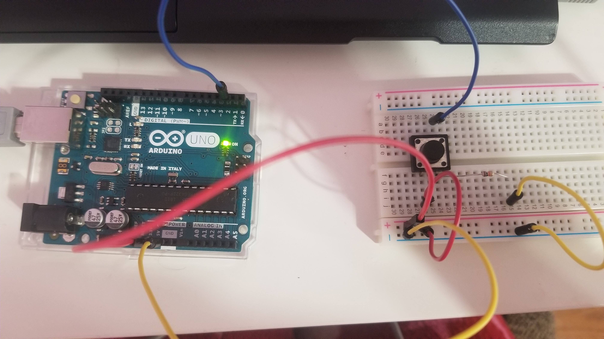

# Tharmeega's Webpage

Welcome to my project page for *INSPIRE 1A03:* _**Electronics for the Rest of Us!**_ I'll use this page to describe and showcase my work and progress throughout the module using text and media. Keep scrolling to view my deliverables: here you'll find reflections, summaries, and device descriptions!

<!--
Welcome to your project page for Electronics for the Rest of Us. You'll use this page to describe and showcase your work throughout the module. 
A place for each deliverable has been created below for you in this markdown document. 
Note that comments (such as this) will not appear in the final markdown document (which you can view with the "Preview" button).
-->


## Day 1: Reflection
I just finished my first year in Arts & Science _(and in our program, we’re known for being indecisive)_, but several months ahead of time I began looking for interesting elective courses to take in the summer. I was really interested in the INSPIRE 1A03 course because of the diversity within the content; I wanted to learn more from different subject areas because I had no idea what I was interested in. I remember a few months ago when I was looking through the module descriptions, Electronics for the Rest of Us seemed difficult because there were several words in the description which I hadn’t known, such as _arduino_. I felt overwhelmed, and immediately sent an email asking if any previous knowledge was required to take this module. The response was that it was aimed at students with no exposure to electronics, making me the perfect type of student to take it. My whole life, I had never explored coding or anything electronics related, and in some ways I was scared to because I thought it would be too difficult and I wouldn’t be good at it. Writing essays and taking arts courses was more my area of interest. However, I was interested in this module because it was a chance to explore something new in an academic setting with professional guidance and support. All I hope to take away from this module is that I can have basic knowledge about electronics, and I definitely am off to a great start, because I know what _arduino_ is now (board, software, programming language, community), and I’ve even built a basic circuit using an arduino board which allows a button to turn a light on!





## Day 2: Results

[Here is the link to the code I used for the RGB LED + thermistor circuit.](https://github.com/inspire-1a03/intersession-2020-tharmeega/blob/master/RGB.ino)

This circuit is one of the most complicated ones that I have made; it uses both an RGB LED and a thermistor! The temperature being sensed by the thermistor is depicted through the RGB LED which changes colours accordingly. Some challenges I faced included the wiring (there was a lot going on in a small area, and it was easy for things to be in the wrong place without being noticed), and also the coding. My serial monitor was not working until I set it to the correct units (11520 baud), and only then would the temperature show accurately. I also learned how to adjust my code! Since I was having a difficult time getting the temperature up to 30, yesterday I adjusted my code so that the LED would turn red at 28 degrees, and since it was warmer in my house today I changed the code so that it was 30 again and changed it in my repository as well! I’m glad this is something I was able to do on my own.


## Arduino build-off results
<!--
Upload your fully-commented Arduino sketch from the final product of your Arduino build-off into the top-level of your module GitHub repository.
In ~300 words, provide a final device description and product pitch:
What does it do? Use a table (created in markdown) to list and describe the features. You can use the template provided below.
Describe briefly how it works.
How could it be used in everyday life (or maybe just in rare cases)?
Be sure to link to your code (in your GitHub repository) in the text of your response.
Include a snippet of code using the characters to display the code properly.
-->

My final device for the arduino-build off is basically another version of my previous device (which uses the RGB light and thermistor), but with another addition! The other addition is a buzzer which makes a noise that corresponds with the change of colour we will see in the RGB LED. It can be used as a weather station that indicates when the temperature is too high or too low. When it is too hot (30 degrees or above), the light will turn red and the buzzer will make a sound, so that people can hear and see the difference, and when when it is 20 degrees or below, the RGB LED will turn blue and the buzzer will make a noise but a different tone. The code for that specific section is as follows:

```
if(temp > 30){


 setColor(255, 0, 0);  // red


  tone(8, 262, 1000);


 }


 else if(temp > 20 & temp < 30){


 setColor(0, 255, 0);  // green


 }


 else {


 setColor(0, 0, 255);  // blue


 tone(8, 900, 1000);


 }


}

```
 
[Here is the link to the full code I used for this device.](https://github.com/inspire-1a03/intersession-2020-tharmeega/blob/master/weather_station.ino)

Below is a table that shows the features of the device, and below that, a testing video!


Feature | Description | Other Notes
------------ | ------------- | ----------
LED light | changes colour depending on temperature | between 20-30: green / 20 or below: blue / 30 or above: red
Buzzer | makes a noise if the temperature reaches outside of the 20-30 range | the tone will be different depending on whether the temperature is too high or too low  
Thermistor| provides information about the temperature and any changes in the temperature | the threshold temperatures (20 and 30) can be changed in the code 


<iframe width="789" height="444" src="https://www.youtube.com/embed/XR2n_l6roBc" frameborder="0" allow="accelerometer; autoplay; encrypted-media; gyroscope; picture-in-picture" allowfullscreen></iframe>


## Final reflection & summary

Throughout this module, my knowledge about electronics and coding has increased greatly, especially considering that I knew absolutely nothing about this topic earlier. Something I liked about this module was that it catered to different levels of experience and ability; if someone wanted to make a more complex device for the final arduino build-off they definitely could have but if someone (like myself) could only build a simple device than that was totally fine too! Both students would have had a great learning experience while completing the module to the best of their ability. I liked this because it allows all students to step out of their comfort zone while taking control of how advanced they want to go. 
Within the course, learning how to make a webpage through github was one of the skills that will definitely aid me in the future, and it was much easier than I thought it would be. The frightening idea of coding was introduced to me with the simple basics which made it more manageable and approachable. I also learned that coding can be used in **a lot** of common websites such as reddit and tumblr! I already used coding to change the layout of my tumblr blog and made it look nicer! I only used the basics that we learned in this module, but that’s still something I would have never known about or tried before taking this module! 
Living in a world where technology is continuously advancing, having this basic knowledge of coding and electronics will allow me to interact with technology (which is something I deal with on a daily basis) with more ease and less hesitation! As with the arduino, I have already been watching some YouTube videos on simple circuits and since I have this arduino kit, I might as well make use of it. Wiring the arduino was challenging for me but once I had rewired it several times I learned that sometimes playing around with it might just get the result I want. I’ve always been someone who likes to play it safe and this course was the first time I learned something outside of my usual subject areas. Overall, after taking this module I feel more electronically literate and won’t be afraid to further delve into electronics or any other new subject area that might seem frightening at first!

##                                                      THANK YOU!
